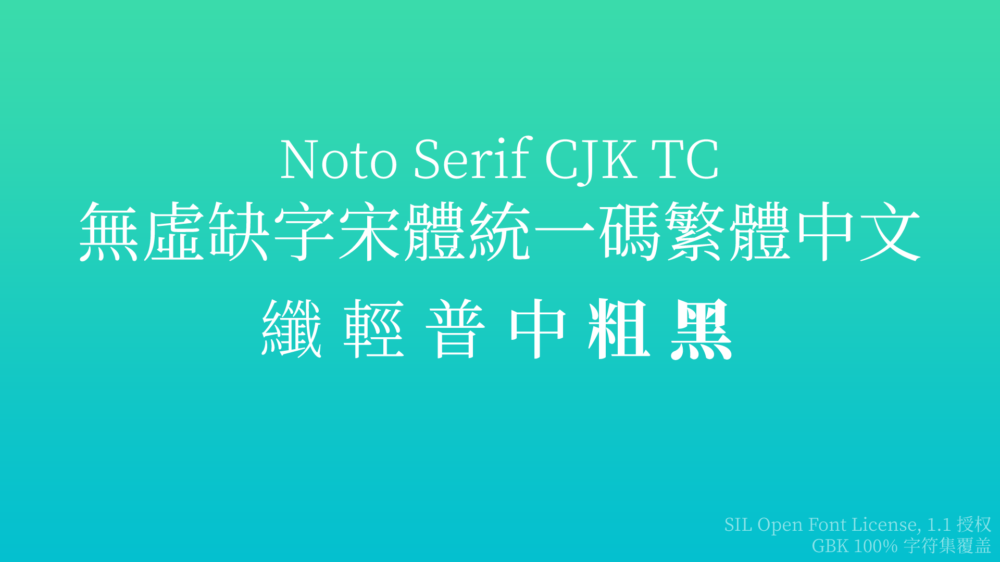

- 本仓库参考 [DrXie/OSFCC](https://github.com/DrXie/OSFCC)。

# 列表

## 术语统一

描述 | 原文 | 译文 | 描述
| - | - | - | -
字重-100 | 纤 | Thin /Hairline
字重-200 | 特纤 | Extra-Light / Ultra-Light
字重-300 | 轻 | Light
字重-350 | 半轻 | Demi-Light
字重-400 | 普 | Regula
字重-500 | 中 | Medium
字重-600 | 半粗 | Demi-Bold / Semi-Bold
字重-700 | 粗 | Bold
字重-800 | 特粗 | Extra-bold / Extra
字重-900 | 重 | Black / Heavy
字重-950 | 超重 | Extra-Black / Ultra-Black
比例 | 等宽 | Mono

## 字体

创作者 | 字体名 | 风格 | 字重及比例数 | 授权协议 | 涵盖字体集 | 专项适配
| - | - | - | - | - | - | -
Google | [Noto Sans CJK / 无虚缺字黑体统一码](#Noto_Sans_CJK) | 黑体 | 9 | SIL Open Font License 1.1 | GBK 100% | 简中、繁中、日、韩。
Google | [Noto Sans CJK / 无虚缺字宋体统一码](#Noto_Serif_CJK) | 宋体 | 7 | SIL Open Font License 1.1 | GBK 100% | 简中、繁中、日、韩。
[霞鹜](https://github.com/lxgw) | [小赖字体](#Xiaolai) | 艺术体 | 2 | SIL Open Font License 1.1 | GBK 100% | 简中、日。
[霞鹜](https://github.com/lxgw) | [霞鹜文楷](#LXGW_WenKai) | 仿宋、楷体 | 6 | SIL Open Font License 1.1 | GBK 63.04%(Big5 67.46%) | 简中、日。

## 图片排版

描述 | 位置 | 配色(高饱和, 低饱和) | 不透明度 | 字号 | 字重 | 备注
| - | - | - | - | - | - | -
介绍-字体名-中文 | 从下往上 572px(540+32) | #fff, #000 | 100%, 87% | 125px | Regular | -
介绍-字体名-英文 | - | - | - | 100px | Light | -
介绍-字重 | 从上往下 572px | - | 54% | 125px | 根据字重选择 | 如只有一种字重可隐藏，并将字体名完全居中。
介绍-参数 | 右下角向内各偏移 16px | - | - | 34px | Regular | 字符集覆盖采用`GBK [百分比]%(Big5 [百分比]%)`形式书写。如果涵盖 100% 的 GBK 字符集则无需书写上述格式括号中内容。
设计-上半 | 从下往上 604px(540+64) | - | - | 125px | Regular | -
设计-下半 | 从上往下 604px | - | - | 125px | Regular | -

# 介绍

## Noto Sans CJK / 无虚缺字黑体统一码

### SC / 简体中文

授权协议 SIL Open Font License 1.1
适配字符集 GBK 100%

**获取** https://www.google.com/get/noto/#sans-hans

### TC / 繁體中文

授权协议 SIL Open Font License 1.1
适配字符集 GBK 100%

**获取** https://www.google.com/get/noto/#sans-hant

## Noto Serif CJK / 无虚缺字宋体统一码

### SC / 简体中文

授权协议 SIL Open Font License 1.1
适配字符集 GBK 100%

**获取** https://www.google.com/get/noto/#serif-hans

### TC / 繁體中文

授权协议 SIL Open Font License 1.1
适配字符集 GBK 100%

**获取** https://www.google.com/get/noto/#serif-hant

## Xiaolai Font / 小赖字体

它基于繁体中文字体内海字体与日文字体濑户字体，目的是适配简体中文。

授权协议 SIL Open Font License 1.1
适配字符集 GBK 100%

**获取** https://github.com/lxgw/kose-font

## LXGW WenKai / 霞鹜文楷

它基于繁体中文字体内海字体与日文字体濑户字体，目的是适配简体中文。

授权协议 SIL Open Font License 1.1
适配字符集 GBK 63.04%(Big5 67.46%)

**获取** https://github.com/lxgw/LxgwWenKai