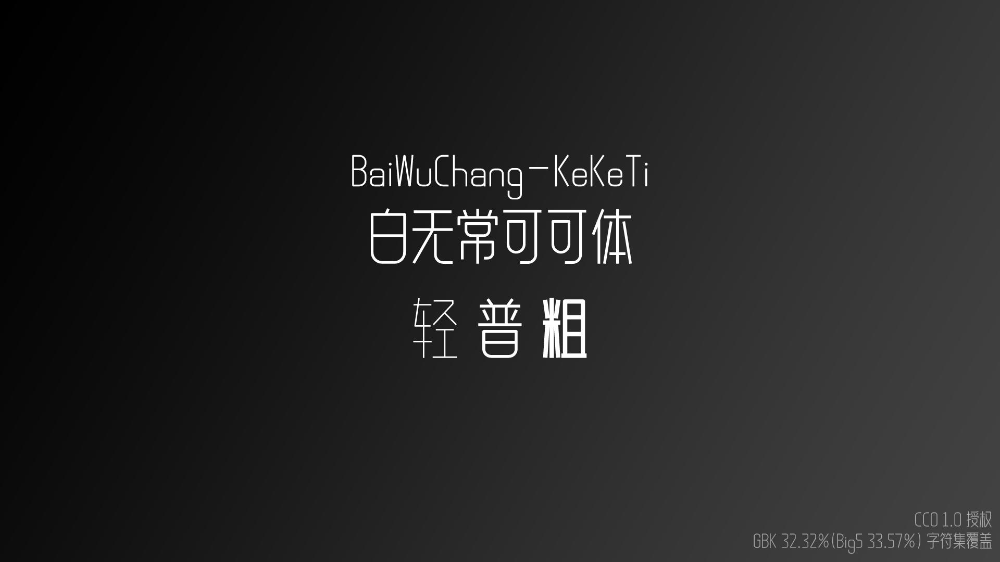
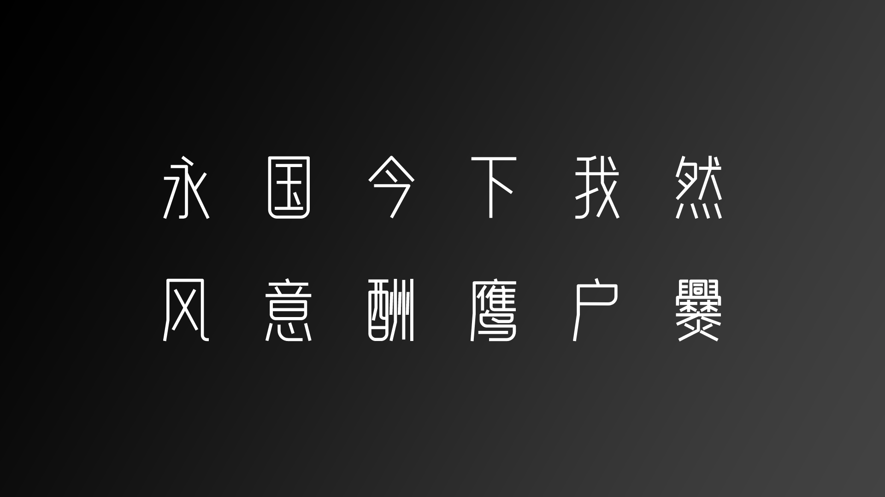
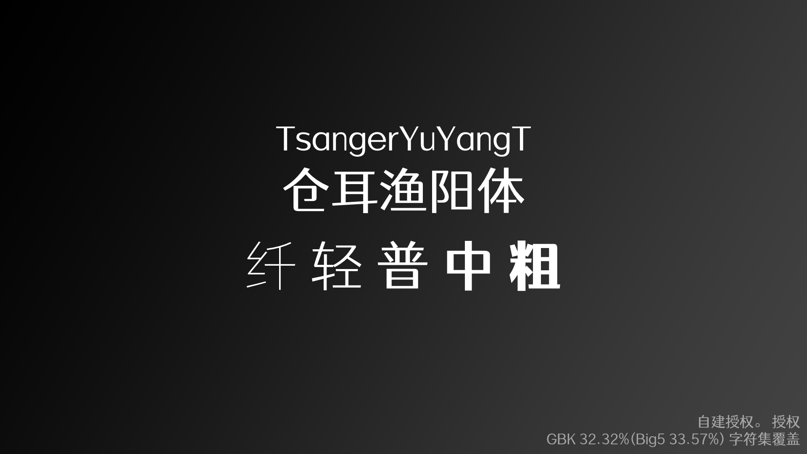
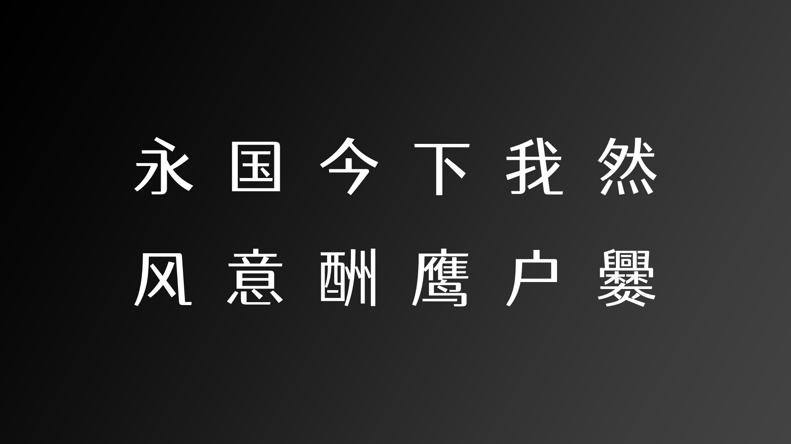

- 本仓库参考 [DrXie/OSFCC](https://github.com/DrXie/OSFCC)。

# 列表

## 术语统一

描述 | 原文 | 译文 | 描述
| - | - | - | -
字重-100 | 纤 | Thin / Hairline / ExtraLight / W1
字重-200 | 极纤 | Extra-Light / Ultra-Light
字重-300 | 轻 | Light / W2
字重-350 | 半轻 | Demi-Light
字重-400 | 普 | Regula / W3
字重-500 | 中 | Medium / W4
字重-600 | 半粗 | Demi-Bold / Semi-Bold
字重-700 | 粗 | Bold / W5
字重-800 | 特粗 | Extra-bold / Extra
字重-900 | 重 | Black / Heavy
字重-950 | 超重 | Extra-Black / Ultra-Black
比例 | 等宽 | Mono

## 字体

创作者 | 字体名 | 字重及比例数 | 授权协议 | 涵盖字体集 | 专项适配
| - | - | - | - | - | -
Google | [Noto Sans CJK / 无虚缺字黑体统一码](#Noto_Sans_CJK) | 9 | SIL Open Font License 1.1 | GBK 100% | 简中、繁中、日、韩。
Google | [Noto Sans CJK / 无虚缺字宋体统一码](#Noto_Serif_CJK) | 7 | SIL Open Font License 1.1 | GBK 100% | 简中、繁中、日、韩。
[霞鹜](https://github.com/lxgw) | [小赖字体](#Xiaolai) | 2 | SIL Open Font License 1.1 | GBK 100% | 简中、日。
[霞鹜](https://github.com/lxgw) | [霞鹜文楷](#LXGW_WenKai) | 6 | SIL Open Font License 1.1 | GBK 63.04%(Big5 67.46%) | 简中、日。
[Max](https://github.com/max32002) | [狮尾圆体](#Swei_Gothic) | 7 | SIL Open Font License 1.1 | GBK 99.98%(Big5 99.98%) | 简中、繁中、日。
[Max](https://github.com/max32002) | [内海字体](#Naikai_Font) | 7 | SIL Open Font License 1.1 | GBK 100% | 繁中、日。
[timothyqiu](https://space.bilibili.com/7092) | [凤凰点阵体](#Vonwaon_Bitmap) | 2 | CC0 1.0 | GBK 32.32%(Big5 33.57%) | 简中。
[白无常C4D](https://space.bilibili.com/350163892) | [白无常可可体](#BaiWuChang-KeKeTi) | 3 | 支付宝公益捐赠1元商用 | GBK 32.32%(Big5 33.57%) | 简中。
[苍耳字库](http://tsanger.cn) | [仓耳渔阳体](#TsangerYuYangT) | 5 | [自建授权](http://tsanger.cn/仓耳字库免费商用字体授权声明.pdf)。免费商用；任何状况不可单独售卖；不得用于违法用途。 | GBK 32.32%(Big5 33.57%) | 简中。

## 图片排版

描述 | 位置 | 配色(高饱和, 低饱和) | 不透明度 | 字号 | 字重 | 备注
| - | - | - | - | - | - | -
介绍-字体名-中文 | 从下往上 572px(540+32) | #fff, #000 | 100%, 87% | 116px | Regular | -
介绍-字体名-英文 | ~ | ~ | ~ | 76px | Light | -
介绍-字重 | 从上往下 572px | ~ | 54% | 126px | 根据字重选择 | 如只有一种字重可隐藏，并将字体名完全居中。
介绍-参数 | 右下角向内各偏移 16px | ~ | ~ | 34px | Regular | 字符集覆盖采用`GBK [百分比]%(Big5 [百分比]%)`形式书写。如果涵盖 100% 的 GBK 字符集则无需书写上述格式括号中内容。
设计-上半 | 从下往上 604px(540+64) | ~ | ~ | 150px | Regular | -
设计-下半 | 从上往下 604px | ~ | ~ | ~ | ~ | -

# 介绍

## Noto Sans CJK / 无虚缺字黑体统一码

由谷歌推出的无虚缺字系列字体的黑体部分。

**获取**

简体中文 https://www.google.com/get/noto/#sans-hans  
繁體中文 https://www.google.com/get/noto/#sans-hant

## Noto Serif CJK / 无虚缺字宋体统一码

由谷歌推出的无虚缺字系列字体的宋体部分。

**获取**
简体中文 https://www.google.com/get/noto/#serif-hans  
繁體中文 https://www.google.com/get/noto/#serif-hant

## Xiaolai / 小赖字体

它基于内海字体与濑户字体，目的是适配简体中文。

**获取** https://github.com/lxgw/kose-font

## LXGW WenKai / 霞鹜文楷

它基于繁体中文字体内海字体与日文字体濑户字体，目的是适配简体中文。

**获取** https://github.com/lxgw/LxgwWenKai

## Swei Gothic / 狮尾圆体

它基于思源黑体，对其进行的拔脚和加圆改造。适配简体中文、繁体中文、韩文与日文。

**获取** https://github.com/max32002/swei-gothic

## Naikai Font / 内海字体

它基于濑户字体，对其进行的繁体中文适配。

**获取** https://github.com/max32002/naikaifont

## Vonwaon Bitmap / 凤凰点阵体

**获取** https://timothyqiu.itch.io/vonwaon-bitmap

## BaiWuChang-KeKeTi / 白无常可可体

**获取** https://www.bilibili.com/video/BV1MB4y1K7Ep#reply4981720861

## TsangerYuYangT / 仓耳渔阳体

**获取** http://tsanger.cn/category/115?page=1